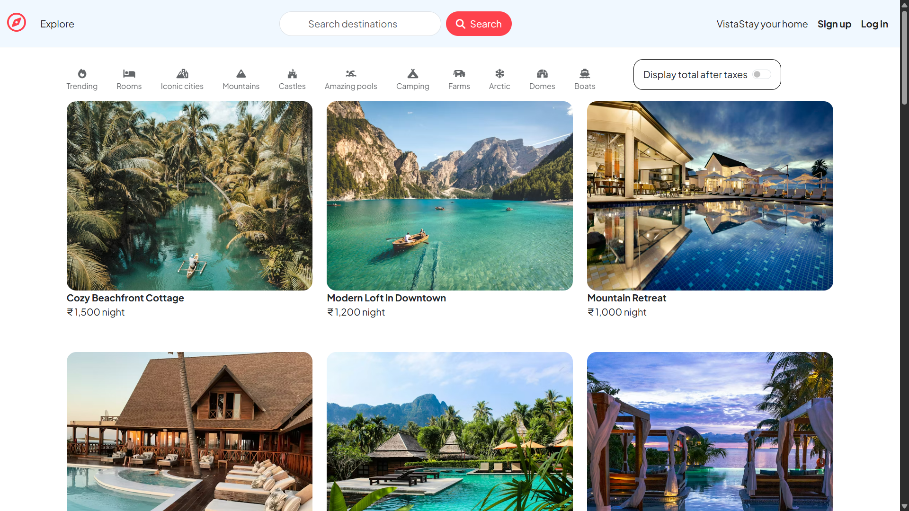

# 🌍 VistaStay 

VistaStay is a full-stack MERN-style rental listing platform inspired by Airbnb, where users can create, manage, explore, and review property listings around the world.

Users can:
- Create property listings
- Upload property images
- View locations on interactive maps
- Add reviews and ratings
- Edit/Delete their own listings
- Authenticate securely

---

# 🚀 Project Preview



---

# 📸 Features

## 🏠 Property Listings
- Add new rental properties
- Upload listing images using Cloudinary
- Edit and delete listings

## 🔐 Authentication & Authorization
- User signup/login/logout
- Secure authentication using Passport.js
- Only owners can edit/delete their listings

## 🗺️ Interactive Maps
- Integrated with Mapbox
- Automatically generates coordinates from location
- Displays property location on map

## ⭐ Reviews & Ratings
- Add reviews and ratings
- Delete reviews
- Review validation

## 📱 Responsive UI
- Built using Bootstrap
- Mobile responsive layout

---

# 🛠️ Tech Stack

## Backend
- Node.js
- Express.js
- MongoDB
- Mongoose

## Frontend
- EJS
- HTML5
- CSS3
- Bootstrap 5

## Authentication
- Passport.js
- Passport Local

## Cloud & Maps
- Cloudinary
- Multer
- Mapbox

## Database Hosting
- MongoDB Atlas

---

# 📂 Project Structure

```bash
VistaStay/
│
├── controllers/
├── models/
├── routers/
├── views/
├── public/
├── utils/
├── init/
├── middleware.js
├── app.js
├── cloudConfig.js
├── schema.js
└── .env
```

---

# ⚙️ Installation & Setup

## 1️⃣ Clone Repository

```bash
git clone https://github.com/bodhekarvarad/VistaStay.git
```

---

## 2️⃣ Navigate to Project Folder

```bash
cd VistaStay
```

---

## 3️⃣ Install Dependencies

```bash
npm install
```

---

## 4️⃣ Create `.env` File

Create a `.env` file in root directory and add:

```env
CLOUD_NAME=

CLOUD_API_KEY=

CLOUD_API_SECRET=

MAP_TOKEN=

ATLASDB_URL=

SECRET=
```

---

# ▶️ Run Project

## Development Mode

```bash
npm run dev
```

## Production Mode

```bash
npm start
```

---

# 🗃️ Database Initialization

To initialize sample listings data:

```bash
node init/index.js
```

---

# 🌐 Setup Required Services

## MongoDB Atlas
- Create MongoDB Atlas account
- Create cluster
- Copy connection string

## Mapbox
- Create Mapbox account
- Generate public access token

## Cloudinary
- Create Cloudinary account
- Get cloud credentials

---

# 🧠 Future Improvements

- Search functionality
- Property categories
- Booking system
- Payment integration
- Wishlist feature
- Chat system
- Admin dashboard

---

# 👨‍💻 Author

## Varad Bodhekar

GitHub:  
https://github.com/bodhekarvarad

---

# ⭐ Support

If you like this project, give it a ⭐ on GitHub!
